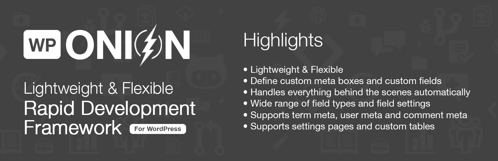

# Welcome

This site aims to be a comprehensive guide to WPOnion Framework. We’ll cover topics such as installation, creating custom meta boxes and fields, get meta value and give you some tutorials on using the plugins to speed up your development workflow.

All the documentation are listed on the left menu. You can also use the search box to find the documentation quickly.


Documentation is still **in-progress**. I'm constantly working on the documentation.  
By the way you can click to edit buttons and help me in improving documentation.


Because a good documentation helps everyone who uses **wponion-framework** and eases getting started with it. It's also useful for wider adoption of wponion framework. Many developers will just skip softwares that have no extensive documentations or that doesn't seem to provide quick solutions for their problems.

## So, What is WPOnion exactly?

WPOnion is a simple yet powerful framework that helps developers build custom meta boxes and custom fields in WordPress fast and easily.

The framework lets you define custom meta boxes and custom fields via arrays and handles everything behind the scene automatically. It has a wide range of field types, field settings and supports not only post meta but also term meta, user meta, comment meta, settings pages and custom tables.

## Contribution

Like WPOnion Framework, this documentation is open sourced on [Github ](http://github.com/wponion/docs)& [GitBooks](https://wponion.gitbook.io/docs). The website's content is written in Markdown.

If you find anything incorrect in the documentation or out-dated, please help us in fixing and improving the documentation.

In case you come across anything along the way that we haven’t covered, or if you know of a tip you think others would find handy, please [file an issue](https://github.com/wponion/docs/issues) and we’ll consider including it in this guide.

