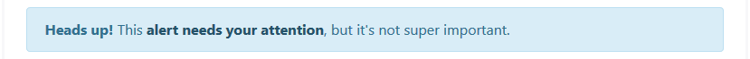
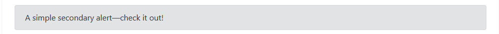
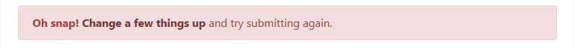
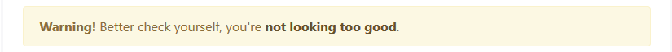

# Notice

#### Code



```php
array(    'type'        => 'notice',    'notice_type' => 'success',)
```





```php
array(    'type'        => 'notice',    'notice_type' => 'info',);
```





```php
array(    'type'        => 'notice',    'notice_type' => 'secondary',)
```





```php
array(
    'type'        => 'notice',
    'notice_type' => 'danger',
)
```





```php
array(
    'type'        => 'notice',
    'notice_type' => 'warning',
)
```





```php
array(
    'type'        => 'notice',
    'notice_type' => 'light',
)
```





```php
array(
    'type'        => 'notice',
    'notice_type' => 'dark',
)
```





