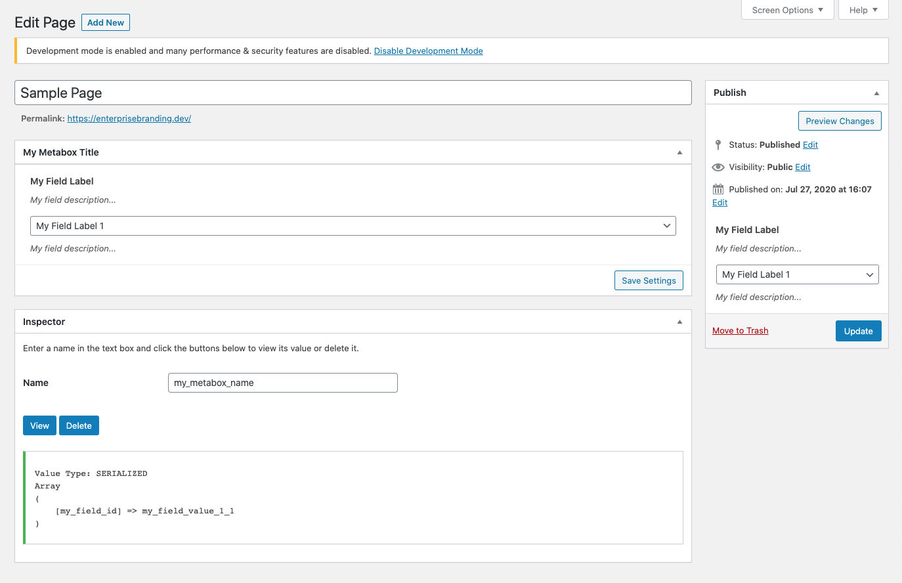

# Admin Columns

## Arguments

<table>
  <thead>
    <tr>
      <th style="text-align:left">Key</th>
      <th style="text-align:left">Default</th>
      <th style="text-align:left">Description</th>
    </tr>
  </thead>
  <tbody>
    <tr>
      <td style="text-align:left"><b>post_type</b>
      </td>
      <td style="text-align:left"><code>false</code>
      </td>
      <td style="text-align:left">
        
<code>array()</code> or <code>string</code> of a post type slug.

        
if provided & none of them matches current
           post type then column will not be rendered

      </td>
    </tr>
    <tr>
      <td style="text-align:left"><b>name</b>
      </td>
      <td style="text-align:left"><code>title</code>/ <code>false</code>
      </td>
      <td style="text-align:left">Column Slug. if not provided then
         it uses <code>title</code> attribute value</td>
    </tr>
    <tr>
      <td style="text-align:left"><b>title</b>
      </td>
      <td style="text-align:left"><code>false</code>
      </td>
      <td style="text-align:left">Column Title</td>
    </tr>
    <tr>
      <td style="text-align:left"><b>render</b>
      </td>
      <td style="text-align:left"><code>false</code>
      </td>
      <td style="text-align:left">String / Array of callback to render output.</td>
    </tr>
    <tr>
      <td style="text-align:left"><b>reorder</b>
      </td>
      <td style="text-align:left"><code>false</code>
      </td>
      <td style="text-align:left">provide a column slug to show after it or
         a callable function to do custom reordering</td>
    </tr>
    <tr>
      <td style="text-align:left"></td>
      <td style="text-align:left"></td>
      <td style="text-align:left"></td>
    </tr>
  </tbody>
</table>## Demo

### Custom Column In Default Post - Post Type



### Column Reorder Options



### Multiple Columns @ Once



