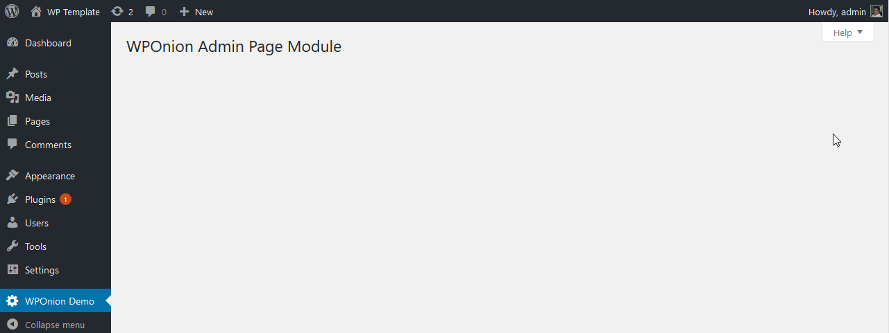

# Help Tabs

## Module Arguments 

<table>
  <thead>
    <tr>
      <th style="text-align:left">Key</th>
      <th style="text-align:left">Default</th>
      <th style="text-align:left">Description</th>
    </tr>
  </thead>
  <tbody>
    <tr>
      <td style="text-align:left"><b>page</b>
      </td>
      <td style="text-align:left">false</td>
      <td style="text-align:left">
        
this should contain a screen id on which page you would like to add the
          help tabs

        
or you can also pass the instance of <b>WPOnion Admin Page</b> Module to
          auto map it.

      </td>
    </tr>
    <tr>
      <td style="text-align:left"><b>tabs</b>
      </td>
      <td style="text-align:left">false</td>
      <td style="text-align:left">An array of page help tabs and its contents</td>
    </tr>
    <tr>
      <td style="text-align:left"><b>sidebar</b>
      </td>
      <td style="text-align:left">false</td>
      <td style="text-align:left">this content will be used to display in the right side of help tab in
        the screen</td>
    </tr>
  </tbody>
</table>## Core WordPress 



## Help Tabs With WPOnion Fields



