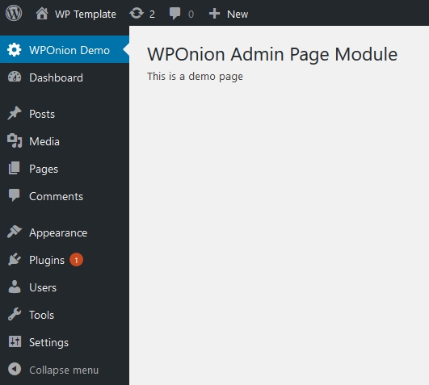
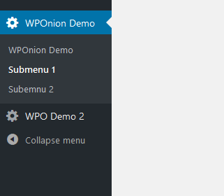
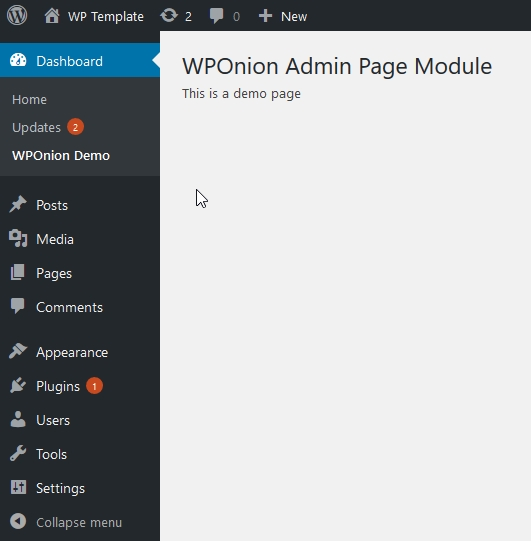
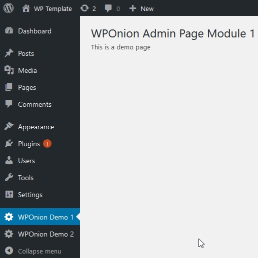
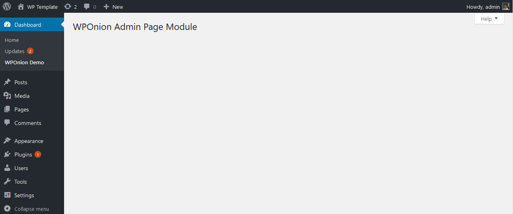

# Admin Page

### Menu Arguments

<table>
  <thead>
    <tr>
      <th style="text-align:left">Key</th>
      <th style="text-align:center">Options</th>
      <th style="text-align:left">Description</th>
    </tr>
  </thead>
  <tbody>
    <tr>
      <td style="text-align:left"><b>menu_title</b>
      </td>
      <td style="text-align:center"><code>false</code>
      </td>
      <td style="text-align:left">The text to be used for the menu</td>
    </tr>
    <tr>
      <td style="text-align:left"><b>page_title</b>
      </td>
      <td style="text-align:center"><code>false</code>
      </td>
      <td style="text-align:left">The text to be displayed in the title tags of the page
         when the menu is selected</td>
    </tr>
    <tr>
      <td style="text-align:left"><b>capability</b>
      </td>
      <td style="text-align:center"><code>manage_options</code>
      </td>
      <td style="text-align:left">The capability required for this menu to be displayed</td>
    </tr>
    <tr>
      <td style="text-align:left"><b>menu_slug</b>
      </td>
      <td style="text-align:center">
        
<code>page_title</code>
        

        
/

        
<code>menu_title</code>
        

      </td>
      <td style="text-align:left">The slug name to refer to this menu by.
         Should be unique for this menu page and only include
         lowercase alphanumeric, dashes, and underscores
         characters to be compatible with <a href="https://developer.wordpress.org/reference/functions/sanitize_key/">sanitize_key()</a>
      </td>
    </tr>
    <tr>
      <td style="text-align:left"><b>icon</b>
      </td>
      <td style="text-align:center"><code>none</code>
      </td>
      <td style="text-align:left">The URL to the icon to be used for this menu.
         * <code>base64-encoded</code> SVG using a data URI,
         which will be colored to match the color scheme. <code>data:image/svg+xml;base64</code>
         * Name of a Dashicons helper class to use a font icon
         e.g.<code>dashicons-chart-pie</code>
         * Pass <code>none</code> to leave <code>div.wp-menu-image</code>
         empty so an icon can be added via CSS.</td>
    </tr>
    <tr>
      <td style="text-align:left"><b>position</b>
      </td>
      <td style="text-align:center"><code>null</code>
      </td>
      <td style="text-align:left">The position in the menu order this one should appear</td>
    </tr>
    <tr>
      <td style="text-align:left"><b>render</b>
      </td>
      <td style="text-align:center"><code>false</code>
      </td>
      <td style="text-align:left">Callable Function to trigger when page loaded to render output.</td>
    </tr>
  </tbody>
</table>### Additional Arguments

<table>
  <thead>
    <tr>
      <th style="text-align:left">Key</th>
      <th style="text-align:center">Options</th>
      <th style="text-align:left">Description</th>
    </tr>
  </thead>
  <tbody>
    <tr>
      <td style="text-align:left"><b>network</b>
      </td>
      <td style="text-align:center"><code>false</code>
      </td>
      <td style="text-align:left">
        
Set <code>true</code> if this page can be visible in <b>WP Network Admin</b>
        

        
Set <code>only</code> if this page should be visible only in <b>WP Network Admin</b>
        

      </td>
    </tr>
    <tr>
      <td style="text-align:left"><b>submenu</b>
      </td>
      <td style="text-align:center"><code>false</code>
      </td>
      <td style="text-align:left">
        
Pass an <code>array()</code> of menu args to create a <a href="admin-page.md#subemenu-options">submenu</a> under
          current menu

        
Pass an <code>string</code> of a menu slug to show current menu under an
          existing menu

        
Check <a href="admin-page.md#subemenu-options">submenu</a> section for more
          details

      </td>
    </tr>
    <tr>
      <td style="text-align:left"><b>on_load</b>
      </td>
      <td style="text-align:center"><code>false</code>
      </td>
      <td style="text-align:left">
        
provided functions will be called when current instance page loads.

        
uses <b>load-{page_slug} | </b><a href="https://codex.wordpress.org/Plugin_API/Action_Reference/load-(page)">Docs</a>
        

      </td>
    </tr>
    <tr>
      <td style="text-align:left"><b>assets</b>
      </td>
      <td style="text-align:center"><code>false</code>
      </td>
      <td style="text-align:left">Pass an array or string of Callback Functions / style or script handles
        to trigger when page loaded to <b>enqueue</b> assets</td>
    </tr>
    <tr>
      <td style="text-align:left"><b>hook_priority</b>
      </td>
      <td style="text-align:center"><code>10</code>
      </td>
      <td style="text-align:left"><b>priority</b> argument to be passed for<b> </b><code>add_action</code>
      </td>
    </tr>
    <tr>
      <td style="text-align:left"><b>help_tab</b>
      </td>
      <td style="text-align:center"><code>array()</code>
      </td>
      <td style="text-align:left">An array or a callback to render custom help tabs.
         please check <a href="help-tabs.md">Help Tabs</a> Module</td>
    </tr>
    <tr>
      <td style="text-align:left"><b>help_sidebar</b>
      </td>
      <td style="text-align:center"><code>&apos;&apos;</code>
      </td>
      <td style="text-align:left">please check <a href="help-tabs.md">Help Tab</a><a href="help-tabs.md">s</a> Module</td>
    </tr>
    <tr>
      <td style="text-align:left"><b>footer_text</b>
      </td>
      <td style="text-align:center"><code>Proudly Powered By WPOnion</code>
      </td>
      <td style="text-align:left">Provide a <code>string</code> or a callback function to change text</td>
    </tr>
    <tr>
      <td style="text-align:left"><b>footer_right_text</b>
      </td>
      <td style="text-align:center"><code>WPOnion Version %s</code>
      </td>
      <td style="text-align:left">Provide a <code>string</code> or a callback function to change text</td>
    </tr>
  </tbody>
</table>## Callbacks

### on\_load











### assets



## Demo

### Menu & Sub menu's



Below code will create a new main admin page.











### WP Sub menus








### Multiple Main Menus



### Page With Help Tabs



