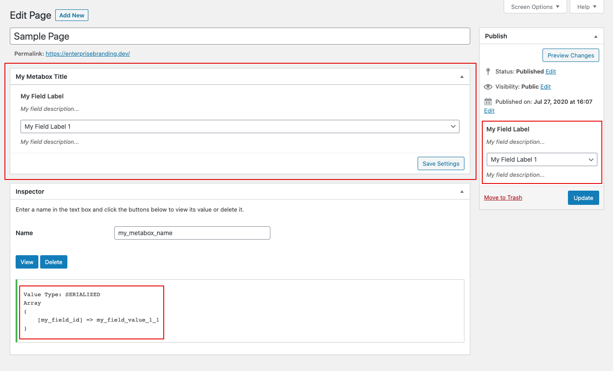

# FAQ

## Code



```php
$this_field = $this_field_instance->this_field('my_field_id');
```



```php
// CREATE: $this_field to our desired field type via our $this_field_instance variable
$this_field = $this_field_instance->this_field('my_field_id');

// ASSIGN: our global field features
// NOTE: these features are available to all field types but are considered unique,
//  like layout, style, dependency values and validation methods, etc...
$this_field->horizontal(true); // DEFAULT: false
$this_field->style('width: 100%;'); // DEFAULT: false

// ASSIGN: our unique field features
// NOTE: these features are only available to this field type
// CONTROLS: this_feature_method | DEFAULT: value
$this_field->this_feature_method();
```




```php
// CALL: wponion/loaded action to load our my_function function
add_action('wponion/loaded', 'my_function');

// CREATE: my_function to load our field and module routine
function my_function() {

  // CREATE: our wponion_builder variable instance
  // NOTE: we always create a wponion_builder variable instance to boot any wponion feature,
  //  then we determine what to do with that instance and its stored arguments
  $this_field_instance = wponion_builder();
  
  // CREATE: $this_field to our desired field type via our $this_field_instance variable
  $this_field = $this_field_instance->this_field('my_field_id');
  
  // ASSIGN: our general field features
  // NOTE: these features are available to ALL field types but are considered general,
  //  like title, text descriptions, debug, etc...
  $this_field->title(__('My Field Label')); // DEFAULT: false
  $this_field->desc(__('My field description...')); // DEFAULT:  false
  $this_field->desc_field(__('My field description...')); // DEFAULT: false
  // $this_field->debug(true); // DEFAULT: false
  
  // ASSIGN: our unique field features
  // NOTE: these features are ONLY available to this field type
  // CONTROLS: this_feature_method | DEFAULT: value
  $this_field->this_feature_method();

  // ASSIGN: our global field features
  // NOTE: these features are available to ALL field types but are considered unique in their usage,
  //  like layout, custom css, dependency values and validation methods, etc...
  $this_field->horizontal(true); // DEFAULT: false
  $this_field->style('width: 100%;'); // DEFAULT: false
  $this_field->help(array('content' => __('This field tooltip...'))); // DEFAULT: false
  
  // CREATE: $this_module_instance options array
  // NOTE: these options vary depending on the module output you choose
  //  like wponion_admin_page, wponion_metabox, wponion_taxonomy, etc...
  $this_module_instance = array(
    'metabox_title' => __('My Metabox Title'),
    'metabox_id'    => 'my-metabox-id',
    'option_name'   => 'my_metabox_name',
    'screens'       => array('post', 'page', 'product',),
    'context'       => 'normal',
    'theme'         => 'wp',
    'ajax'          => true,
  );

  // CALL: our wponion_metabox module
  // NOTE: Here you can call your desired module method
  //  like wponion_admin_page, wponion_metabox, wponion_taxonomy, etc...
  //  We are passing our module settings and our various field settings into our desired module output
  // NOTE: in a more real world use, $this_field_instance would contain multiple fields and their settings
  //  instead of the one field shown in our documentation demo
  wponion_metabox($this_module_instance, $this_field_instance);

}
```





```php
// IF: My_Class doesn't exist
if (!class_exists('My_Class')) {

  // CALL: wponion/loaded action to load our My_Class class
  add_action('wponion/loaded', function() {
    
    // INSTANTIATE: My_Class
    new My_Class();

  });

  // CREATE: My_Class class
  final class My_Class {

    // CREATE: our class constructor method
    public function __construct() {

      // CALL: my_function to load our field and module routine
      $this->my_function();

    }

    // CREATE: my_function function to load our field and module routine
    private function my_function() {

      // CREATE: our wponion_builder variable instance
      // NOTE: we always create a wponion_builder variable instance to boot any wponion feature,
      //  then we determine what to do with that instance and its stored arguments
      $this_field_instance = wponion_builder();
      
      // CREATE: $this_field to our desired field type via our $this_field_instance variable
      $this_field = $this_field_instance->this_field('my_field_id');
      
      // ASSIGN: our general field features
      // NOTE: these features are available to ALL field types but are considered general,
      //  like title, text descriptions, debug, etc...
      $this_field->title(__('My Field Label')); // DEFAULT: false
      $this_field->desc(__('My field description...')); // DEFAULT:  false
      $this_field->desc_field(__('My field description...')); // DEFAULT: false
      // $this_field->debug(true); // DEFAULT: false
      
      // ASSIGN: our unique field features
      // NOTE: these features are ONLY available to this field type
      // CONTROLS: this_feature_method | DEFAULT: value
      $this_field->this_feature_method();

      // ASSIGN: our global field features
      // NOTE: these features are available to ALL field types but are considered unique in their usage,
      //  like layout, custom css, dependency values and validation methods, etc...
      $this_field->horizontal(true); // DEFAULT: false
      $this_field->style('width: 100%;'); // DEFAULT: false
      $this_field->help(array('content' => __('This field tooltip...'))); // DEFAULT: false
      
      // CREATE: $this_module_instance options array
      // NOTE: these options vary depending on the module output you choose
      //  like wponion_admin_page, wponion_metabox, wponion_taxonomy, etc...
      $this_module_instance = array(
        'metabox_title' => __('My Metabox Title'),
        'metabox_id'    => 'my-metabox-id',
        'option_name'   => 'my_metabox_name',
        'screens'       => array('post', 'page', 'product',),
        'context'       => 'normal',
        'theme'         => 'wp',
        'ajax'          => true,
      );

      // CALL: our wponion_metabox module
      // NOTE: Here you can call your desired module method
      //  like wponion_admin_page, wponion_metabox, wponion_taxonomy, etc...
      //  We are passing our module settings and our various field settings into our desired module output
      // NOTE: in a more real world use, $this_field_instance would contain multiple fields and their settings
      //  instead of the one field shown in our documentation demo
      wponion_metabox($this_module_instance, $this_field_instance);

    }

  }

}
```





```php
// CALL: post_submitbox_misc_actions action to load our render_this_field_externally function
// NOTE: you can render a single wponion field into any custom wp do_action location
// NOTE: you must write your own saving methods when rendering a wponion field externally
add_action('post_submitbox_misc_actions', 'render_this_field_externally');

// CREATE: render_this_field_externally to load our field and module routine
// NOTE: our wpo_field function can only echo a single field at a time
//  you cannot pass multiple field types into the final echo ..->render()
function render_this_field_externally() {

  // CREATE: our wponion_builder variable instance
  // NOTE: we always create a wponion_builder variable instance to boot any wponion feature,
  //  then we determine what to do with that instance and its stored arguments
  $this_field_instance = wponion_builder();
  
  // CREATE: $this_field to our desired field type via our $this_field_instance variable
  $this_field = $this_field_instance->this_field('my_field_id');
  
  // ASSIGN: our general field features
  // NOTE: these features are available to ALL field types but are considered general,
  //  like title, text descriptions, debug, etc...
  $this_field->title(__('My Field Label')); // DEFAULT: false
  $this_field->desc(__('My field description...')); // DEFAULT:  false
  $this_field->desc_field(__('My field description...')); // DEFAULT: false
  // $this_field->debug(true); // DEFAULT: false
  
  // ASSIGN: our unique field features
  // NOTE: these features are ONLY available to this field type
  // CONTROLS: this_feature_method | DEFAULT: value
  $this_field->this_feature_method();

  // ASSIGN: our global field features
  // NOTE: these features are available to ALL field types but are considered unique in their usage,
  //  like layout, custom css, dependency values and validation methods, etc...
  $this_field->horizontal(true); // DEFAULT: false
  $this_field->style('width: 100%;'); // DEFAULT: false
  $this_field->help(array('content' => __('This field tooltip...'))); // DEFAULT: false
  
  // CALL: our single field render method
  // NOTE: we can only echo a single field at a time
  //  you cannot pass multiple field types into echo ->render()
  echo $this_field->render('my-custom-name-value', 'my_option_name');

}
```




## Output



## Notes

There are currently no extra notes for this operation.

